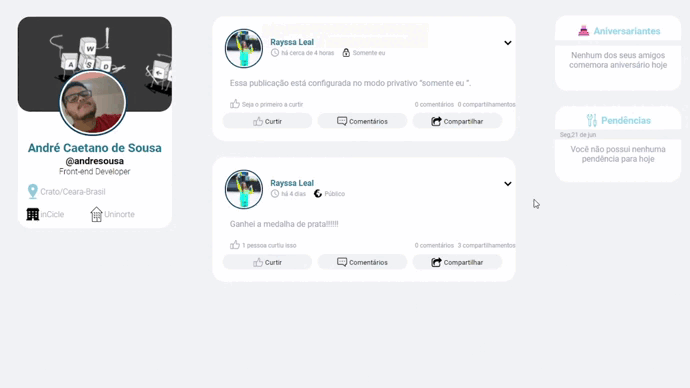

<h1 align="center">
   Desafio Front-end InCicle
</h1>

 

## 📷: Demonstração

  

## 🚀 Tecnologias:

Esse projeto foi desenvolvido com as seguintes tecnologias:

✔️React
✔️Styled-components
✔️Reat-Icons

## Observações:

Clonei o layout no Figma para agilizar com o desenvolvimento do projeto.
Segue o Link do Figma: https://www.figma.com/file/GzZOZNFixgO2byADq7WXmR/inCicle?node-id=0%3A1

## 🚀 Como Inicar o projeto:

PASSO1: Instale o NODEJS em sua máquina, se já tiver instalado não é necessário instalar novamente.

PASSO2: Abre a pasta e acesse o terminal do seu sistema operacional, digite NPM START, caso tenha o Yarn instalado é só digitar YARN START.
